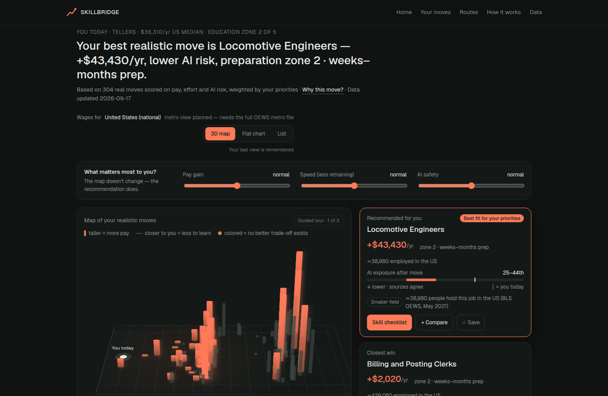
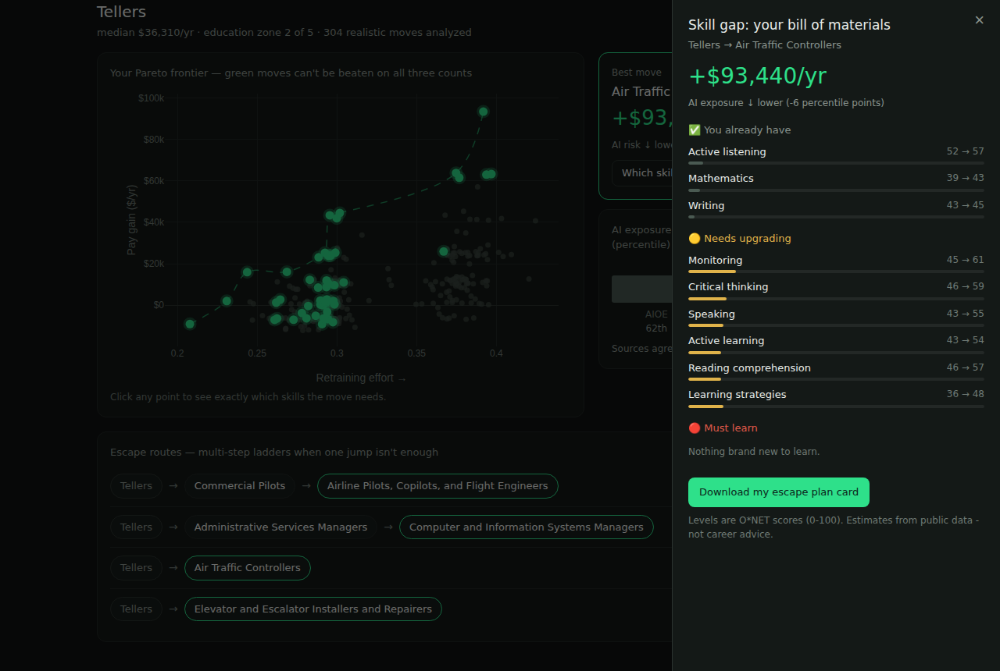

# SkillBridge AI

**Find realistic career moves with higher pay, smaller skill gaps, and lower AI exposure.**

Type your job title. SkillBridge maps every realistic career transition on a
**Pareto Reskilling Frontier** — the moves that raise your salary, minimize
retraining, and lower your AI-displacement risk at the same time — then hands
you the exact **skill checklist** for the move you pick.



> *Real result, real data: for a bank teller, the frontier's best move is Air
> Traffic Controller (+$93,440/yr, lower AI risk, no degree required — education
> zone 3). And the "obvious" next steps? Loan clerks and bookkeeping sit **off**
> the frontier: they pay a little more but carry* ***more*** *AI exposure than
> the teller job itself. That insight is the product.*

**Live demo:** https://samysoserious.github.io/skillbridge/ — free static edition on GitHub Pages, built and deployed automatically by CI from the same pipeline.

<!-- M4: pinned 30-second demo video goes here -->

## Why this exists

Career recommenders answer "what jobs are similar to mine?" — the wrong
question. The right question is **"which move is worth it?"** That is a
three-objective optimization problem over real labor-market data, and no
common portfolio project combines skill distance, wage deltas, and
**three independent AI-exposure indices** with Pareto optimization and
multi-hop path search. SkillBridge does.

## Signature mechanics

| Mechanic | What you see |
|---|---|
| **Pareto Reskilling Frontier** | Scatter of ~300 realistic moves; the green non-dominated set is instantly visible |
| **Skill-Gap Bill of Materials** | Click a move → ✅ already have / 🟡 upgrade / 🔴 must learn, ranked, with real O*NET levels |
| **Escape Routes** | Beam-searched 2–3 hop ladders: `Tellers → Administrative Services Managers → IT Managers (+$122,700)` |
| **Honest AI-risk triangulation** | Three sources (AIOE · OpenAI · Microsoft) always shown side by side, with a disagreement flag |
| **Escape-plan share card** | One click → a 1200×630 PNG rendered server-side |



## Architecture

```text
7 pinned real sources (O*NET skills & tasks · BLS OEWS wages · AIOE · OpenAI · Microsoft)
        ↓  ingestion (checksummed, fail-fast, idempotent)
   DuckDB warehouse — dbt: staging → core → marts, 50 tests incl. crosswalk ≥95% gate
        ↓
   Career engine (pure numpy): asymmetric 4-term skill gap · Pareto fronts ·
   beam-search escape routes — precomputed once to parquet artifacts (~13s)
        ↓
   FastAPI — serves precomputed answers (<50ms) + the static frontend
        ↓
   Hand-built HTML/CSS/JS + vendored Plotly.js (no framework, no build step)
```

Key decisions, briefly:

- **DuckDB + dbt** — the crosswalk between O*NET occupations, SOC codes, and
  OEWS wage rows is the riskiest layer, so it lives in tested SQL
  (`dim_soc_crosswalk`, coverage gate at 95%; actual: 96.4%).
- **Everything precomputed** — the API reads parquet lookups; the browser does
  zero math beyond formatting. Contract tests pin every response shape.
- **The skill gap is asymmetric and 4-term** — skill-profile distance, skill
  *deficits* (moving up costs more than down), O*NET Job-Zone (education)
  distance, and TF-IDF task-content distance over 19k real O*NET task
  statements. Weights live in `config.yaml`, documented in
  [docs/03_ARCHITECTURE.md](docs/03_ARCHITECTURE.md).
- **No fake precision** — suppressed wages are NULL (never 0), top-coded wages
  are flagged (never guessed), exposure is shown as three percentiles, never
  one merged score.

## Data

All real, all public, all pinned to exact commits and checksummed
([docs/04_DATASETS.md](docs/04_DATASETS.md)):
O*NET basic skills, Job Zones and 19k task statements (USDOL) · BLS OEWS
national wages (May 2021) · AIOE (Felten, Raj & Seamans) · "GPTs are GPTs"
(OpenAI/Eloundou et al., MIT) · "Working with AI" (Microsoft Research, CC BY 4.0).

Every filter and join loss is counted in the auto-generated
[`data/data_quality.md`](data/data_quality.md). The bundled
`data/sample/` fixture is synthetic, clearly labeled, and exists only so CI
and `make demo` run with zero downloads.

## Quickstart

```bash
git clone https://github.com/SAMYSOSERIOUS/skillbridge.git
cd skillbridge
make setup     # venv + deps
make build     # full pipeline: ingest (GitHub-only downloads) → dbt → engine → report
make app       # http://localhost:8000
```

No time for the pipeline? `make demo` runs instantly on the synthetic fixture.
`make test` runs ruff + 22 pytest checks; dbt's 50 data tests run inside
`make build`. Windows without make: the same commands are three lines each —
see the Makefile.

## Transparency & limitations

The app ships a visible Methodology / Data & limitations section, and the short
version is: O*NET describes the *typical* job holder, not you; exposure indices
measure *exposure*, not certain displacement (and the app shows you when they
disagree — 259 occupations); wages are national May 2021 medians with no
cost-of-living adjustment. This is analysis of public data, **not career
advice**. Deferred to v1.1: metro-level wage arbitrage map, the full 200+
O*NET descriptor space, free-text job input via embeddings.

## Repo map

| Path | What |
|---|---|
| `docs/` | Project profile, plan, roadmap, architecture, datasets, design brief |
| `python/skillbridge/` | `ingest/` · `engine/` (pure, unit-tested) · `api/` · `cards/` · `quality.py` |
| `dbt/` | dbt-duckdb project: staging → core → marts + 50 tests |
| `web/` | Hand-built frontend (tokens in `styles.css` per `docs/05_DESIGN.md`) |
| `flows/pipeline.py` | Fail-fast pipeline runner (`make build`) |
| `.github/workflows/` | CI (lint + tests) and the Pages deploy (pipeline → static export → publish) |
| `data/sample/` | Synthetic CI fixture (labeled) |
| `CLAUDE.md` | Working rules used to build this repo with Claude Code |

## Attribution

> This product uses the O*NET Database by the U.S. Department of Labor,
> Employment and Training Administration (USDOL/ETA), used under the CC BY 4.0
> license. Wage data: U.S. Bureau of Labor Statistics, OEWS. AI-exposure
> indices: Felten, Raj & Seamans (AIOE); Eloundou et al. (OpenAI, MIT license);
> Tomlinson et al. (Microsoft Research, CC BY 4.0). SkillBridge is not endorsed
> by any of these organizations.

Code: MIT. Data licenses per source.
